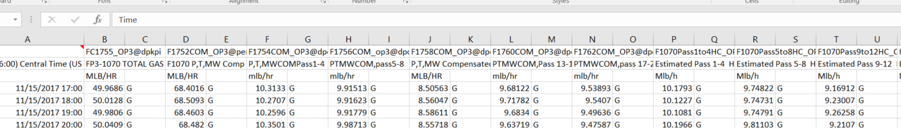

# Refinery Decoking Prediction

The initial attempts at predicting decoking periods of refinery furnaces based on data (2017-11 to 2018-07) from process engineers.
The goal is to help engineers take active control of possible imminent decoking and therefore help reduce the costs due to shut-down of the furnaces.
***

## Prerequisites
Models:
* [scikit-learn]
* [keras]
* [tensorflow]

Plots:
* [seaborn]
* [matplotlib]
* [plotly]
* [pdpbox]

Tuning:
* [sigopt]

Generic: 
* [Numpy]
* [pandas]
* [datetime]
* [simplejson]
* [csv]
* [pickle]
* [math]

## How it works
* The idea, simply, is to predict VPR(venturi pressure) for 20 passes of the furnaces. If any of them is over 0.95, then it indicates decoking needs. 
* We are utilizing two approaches: Long short term memory(LSTM) and Gradient boosting (GBM) for the prediction.
* The raw data: time stamped data of lots of variables stored in XOP, ndP, VPR, Flow, Temperature, Decoke, FireboxandDMDS, Analyzers, Severity sheets in the excel file

* For LSTM: 
 1. Data processing: drop indicator (QC) columns, fill not 'G'ood data with NaNs, drop irrelevant variables and variables with too much NaNs, interpolating and rolling
 2. EDA: distribution plots for un-rolling and rolling, correlation check
 3. Model: convert time series to supervised learning, data scaling, split data, train and validate, evaluate with loss and RMSE, and plot the predicted vs true for each pass 
 4. Tuning: define the key metrics to optimize, send to SigOpt API and bayesian optimized the hyperparameters, fetch the results, and feedback to the Model and repeat 3
* For GBM: 
 1. Borrow the data processed by LSTM in 1.
 2. Data transformation into supervised learning, split data, and random search and cross-validate hyperparamters for GBM for 'n_estimators',  'max_depth', 'min_samples_split', 'learning_rate', 'max_features','loss'
 3. For each pass, load the random search result,  plot feature importance, plot parital dependence (for top 10), plot predicted vs true for test and all history 

## File Organizations
* DecokingPrediction: Main folder with LSTM and GBM in 2 subfolders: LSM20passes & GBM20passes
  1. code: python files 
  2. data: data processed from imtermediate steps
  3. demos: jupyter notebook with all content and corresponding converted html file
  4. output: major output images 
  5. search: tuning results
  (6. model: saved model 
   7. featureimportance: plots and partial dependence plots)
* Data: raw data
* StudyMaterials: project related readings
* PresentationSlides: all touchdown slides
* Experiments: previous explorations, including ones that were not adopted in the final models
* README: this file

## To-dos
* Apply in rest of the refineries
* Make adjustments according to engieers' needs
* UI

## Acknowledgments
* Special thanks to Deval for guidance along the way
* To Bryce providing domain expertise, to Luis & Mario making the collaboration possible
* And to all rest of people here that make my intership at Shell extra wonderful

## Authors
* **Ginny Zhu** - *Initial work* - [github profile](https://github.com/chocolocked)
* **Coded by Ginny, with love :)**
